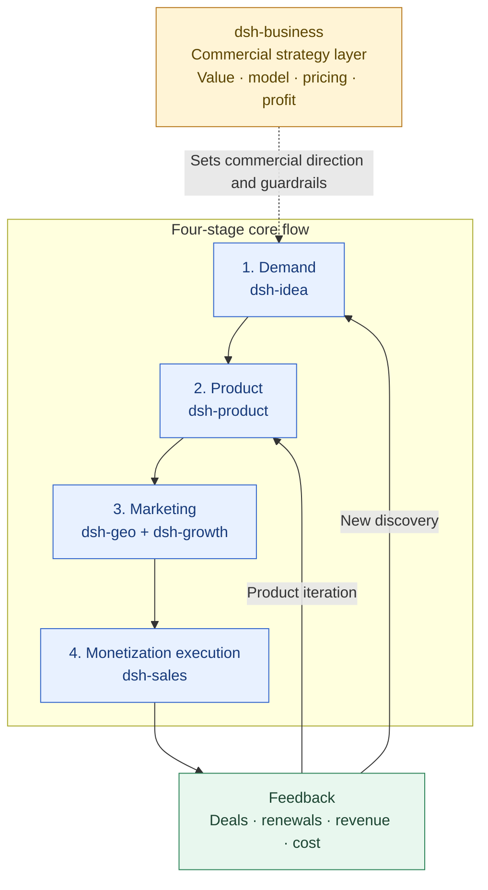

# Growth Acquisition for DeepSeek Harness

English | [中文](./README.zh.md)

`dsh-growth` 是一个本地优先的 DeepSeek Harness 插件，用于把 Markdown、CSV 和 JSONL 中的增长资料与业务数据，转化为可解释的增长诊断、落地方案和执行 SOP。

`dsh-growth` is a local-first DeepSeek Harness bundle for evidence-backed user growth and customer acquisition analysis, actionable plans and execution SOPs.

It covers AARRR funnels, activation, retention cohorts, referral loops, MRR bridges, CAC/LTV/payback, HADI experiments, RICE prioritization and WBR/MBR reports for Markdown, CSV and JSONL data.

## Plugin Positioning and Collaboration Navigation

`dsh-growth` is the growth operating layer in the six-plugin system. It connects acquisition, activation, retention, revenue and experiment data to answer “what changed, why did it change and what should happen next?”

- **Owns:** AARRR funnels, activation, retention cohorts, referrals, MRR, CAC/LTV/Payback, growth diagnosis, HADI experiments, prioritization and WBR/MBR/QBR.
- **Inputs:** Product/PMF event definitions from [dsh-product](../dsh-product/README.md), pricing and margin rules from [dsh-business](../dsh-business/README.md), sales pipeline data from [dsh-sales](../dsh-sales/README.md), and content/search acquisition signals from [dsh-geo](../dsh-geo/README.md).
- **Outputs:** Traceable metric diagnoses, funnel/retention/revenue analyses, experiment cards, operating reviews and next actions for product, commercial strategy, sales and opportunity discovery.
- **Does not own:** Product definition, commercial pricing, sales follow-up or website engineering. It analyzes and plans growth; it does not treat unvalidated metrics as conclusions.

## Positioning Architecture: Commercial Strategy Layer + Four-Stage Core Flow

The six plugins work together to turn a real demand signal into a deliverable product, reach target customers through marketing, and use monetization results to drive product iteration or discover new opportunities.



This plugin covers growth measurement and experimentation in the marketing stage: it puts the discoverability from [dsh-geo](../dsh-geo/README.md), product behavior and closes from [dsh-sales](../dsh-sales/README.md) into one measurement and experimentation framework. [dsh-business](../dsh-business/README.md) provides commercial goals and economic boundaries; when monetization results signal a problem, the evidence feeds [dsh-product](../dsh-product/README.md) for product iteration or [dsh-idea](../dsh-idea/README.md) for new opportunity discovery.

## Plugin Navigation

| Plugin | Clear responsibility | Direct link |
| --- | --- | --- |
| dsh-idea | External opportunities, demand signals, candidate directions and smallest useful tests | [README](../dsh-idea/README.md) |
| dsh-product | Product definition, POC/MVP, release gates and PMF | [README](../dsh-product/README.md) |
| dsh-business | Cross-cutting commercial strategy, value, pricing and profitability | [README](../dsh-business/README.md) |
| dsh-sales | Monetization execution: qualification, deal progression, closing, expansion and renewal | [README](../dsh-sales/README.md) |
| dsh-growth | Acquisition, activation, retention, revenue analysis and growth experiments (this plugin) | [README](./README.md) |
| dsh-geo | SEO/GEO/AEO, content production and search/answer-engine discoverability | [README](../dsh-geo/README.md) |

## Recommended Handoffs

| Output from this plugin | Hand off to | Handoff question |
| --- | --- | --- |
| Activation/retention/feature-use diagnoses and experiment results | [dsh-product](../dsh-product/README.md) | Which product behaviors or scope should change? |
| CAC, LTV, MRR, Payback and channel contribution | [dsh-business](../dsh-business/README.md) | Do current prices, packages and channels support profitable growth? |
| Source, sales conversion and pipeline efficiency | [dsh-sales](../dsh-sales/README.md) | Which sales stages or customer types deserve priority? |
| Content traffic, queries, low CTR and discoverability opportunities | [dsh-geo](../dsh-geo/README.md) | Which pages and content experiments can improve high-intent acquisition? |
| Repeated new problems, user segments and contexts | [dsh-idea](../dsh-idea/README.md) | Has a new opportunity or demand hypothesis emerged? |

## User and company pain points

Growth work often breaks down in the gap between data, decisions and execution:

| Pain point | Required capability |
| --- | --- |
| Growth data is scattered across notes, event exports, revenue sheets and team documents. | Read local Markdown, CSV, JSON and JSONL with a consistent analysis flow. |
| Teams use different definitions for activation, retention, CAC, LTV and MRR. | Make metric definitions, fields, periods, sources and caveats explicit. |
| Funnel dashboards show where users drop, but not what to investigate next. | Identify bottlenecks, segment differences, evidence gaps and next checks. |
| Ideas become long backlogs without a falsifiable hypothesis or owner. | Turn opportunities into HADI experiments with guardrails and RICE/ICE scores. |
| Weekly and monthly reviews are repetitive, disconnected from experiments and hard to audit. | Generate evidence-linked WBR, MBR, QBR and experiment-review Markdown. |
| Sensitive customer data should stay inside the company's knowledge boundary. | Keep analysis local-first with path limits, warnings and guarded writes. |

## Application scenarios

| Scenario | How `dsh-growth` is used |
| --- | --- |
| New product or PMF discovery | Audit JTBD, ICP, PMF Survey, North Star and evidence readiness. |
| Customer acquisition | Compare acquisition, activation and revenue conversion by channel and segment. |
| Onboarding optimization | Locate the activation bottleneck and create a measurable HADI experiment. |
| Retention improvement | Build day/week/month cohorts, inspect lifecycle states and compare user segments. |
| SaaS or subscription monetization | Reconcile MRR movements and calculate ARR, NRR, CAC, LTV and payback. |
| Growth operating cadence | Produce weekly/monthly reviews with findings, decisions, caveats and next actions. |
| External acquisition | Screen product directories and discovery channels, run a quality-gated pilot, and connect verified referrals back to AARRR. |

## Included tools

| Tool | Purpose |
|---|---|
| `growth_onboarding` | Run a read-only readiness check across strategy notes and datasets; show ready, partial, missing and unsupported methods, the current SOP gate and the top two gaps |
| `growth_doctor` | Check the local workspace and summarize dataset health before analysis |
| `growth_profile_dataset` | Infer fields, coverage, date range and data-quality warnings without raw rows |
| `growth_review` | Start from a business goal and orchestrate profiling, analysis, bottleneck and next actions; paths may be omitted for local auto-discovery |
| `growth_audit_note` | Audit one growth note for JTBD, PMF, North Star, AARRR and evidence quality |
| `growth_audit_vault` | Scan a local knowledge base for growth-document gaps |
| `growth_funnel_analyze` | Analyze AARRR-style event funnels by channel and segment |
| `growth_cohort_analyze` | Analyze retention cohorts and lifecycle states |
| `growth_economics` | Calculate MRR bridge, CAC, LTV, NRR and payback |
| `growth_diagnose` | Diagnose a growth change and rank evidence-backed hypotheses |
| `growth_experiment` | Create a HADI experiment card and RICE/ICE score |
| `growth_prioritize` | Rank growth opportunities with RICE or ICE |
| `growth_report` | Generate WBR, MBR, QBR or experiment-review Markdown |
| `growth_apply` | Preview or guarded-write Markdown under the configured root |

The optional `growth-acquisition-execution` skill adds external channel resources and a controlled directory-submission planning SOP. It is intentionally separate from deterministic metric tools because live site rules, browser state and human verification change over time. It only qualifies resources, prepares plans and handoffs; it does not browse, create accounts, fill forms or submit to external sites.

The optional `growth-ai-discoverability` skill adds an AI Search / Discoverability Readiness method for deciding which crawlability, structured-data, content-trust and commerce-feed checks apply to a business. It produces a readiness matrix and implementation plan; it does not scan or modify websites and does not depend on GEO-PRO.

The optional `growth-strategy-planning` skill routes classic growth methods such as Value Proposition Canvas, Lean Canvas, Bullseye channels, Activation Events, Churn/Win-back, Opportunity Solution Trees, user interviews, referral loops, market sizing, pricing research, B2B revenue funnels and Growth Accounting into small, evidence-backed planning artifacts. It does not add live execution or replace the deterministic metric tools.

## Quick start

### Zero-threshold path

You do not need to know the tool names, AARRR definitions, field mappings or which dataset to open first. You only need:

1. A business question, such as “why did activation fall?” or “which acquisition channel should we scale?”
2. A configured local growth root, or a file path if you already know the relevant file.
3. Permission to read local data; the plugin does not upload your vault.

For a new project, start with a readiness check:

```text
Run a growth onboarding check for my configured root.
Tell me what is ready, partial, missing and not supported, and give me only the top two gaps to fix next. Do not write files.
```

It checks growth notes and local CSV/JSON/JSONL datasets without returning raw user rows. It also shows which classic methods are detected in the project, which are only available as audits or templates, and which require an external system. If you already know the goal and want analysis immediately, use `growth_review` instead.

The shortest first review request is:

```text
Run a growth review for the goal "improve activation" using the best available data under my configured root.
Show me which files you selected, what is missing, the biggest bottleneck and the next check. Do not write files.
```

If no paths are supplied, `growth_review` scans the configured root, profiles supported CSV/JSON/JSONL files, selects the most analysis-ready event and MRR sources, and explains the selection. If there are several candidates, confirm the selected files before making a budget or product decision.

Install the plugin into a DeepSeek Harness profile:

```bash
npx --yes @deepseek-ai/dsh plugin --profile growth add dsh-growth
npx --yes @deepseek-ai/dsh --profile growth --dump-config
```

If the Harness host is not running yet, start its Web UI first:

```bash
npx --yes @deepseek-ai/dsh web
```

Then open `http://127.0.0.1:3080` in your browser and use the `growth` profile. DeepSeek Harness's official repository documents this Web UI entry point; the host is in developer preview, so its setup commands may evolve.

If `dsh` is already on your `PATH`, the equivalent short form is `dsh plugin --profile growth add dsh-growth`.

Configure the plugin through the host. A minimal configuration is:

```yaml
defaultRoot: "<your-local-growth-root>"
reportDir: ".dsh-growth/reports"
defaultCurrency: "CNY"
defaultTimezone: "Asia/Shanghai"
```

Then use the tools from the conversation. Typical requests are:

```text
Run a growth review for the goal "improve activation" using the best available data under my configured root; show which files you selected and what is missing.
Run a growth review for the goal "improve activation" using events.csv; tell me what is missing before making a recommendation.
Audit growth-plan.md for PMF, North Star, AARRR metrics and evidence gaps.
Analyze events.csv as an AARRR funnel and compare channel and segment performance.
Analyze mrr.csv for MRR Bridge, NRR, CAC, LTV and Payback using a gross margin of 0.8.
Turn the largest activation bottleneck into a HADI experiment and score it with RICE.
Generate this week's WBR as Markdown; do not write a file yet.
```

### The recommended conversation flow

Use these six requests in order when you are new to the plugin:

```text
1. Run a growth onboarding check; tell me what is ready, partial, missing and not supported.
2. Review the goal "improve activation" and tell me what is missing before giving a conclusion.
3. Break down the bottleneck by channel and segment; separate evidence from hypotheses.
4. Turn the highest-leverage hypothesis into a HADI experiment with a primary metric and guardrails.
5. Score the experiment with RICE and show which inputs are estimates rather than observed facts.
6. Generate this week's WBR; preview only and do not write a file.
```

You can replace the goal and the file names without changing the workflow. Advanced users may call the individual tools directly, but that is optional.

### The operating SOP

Treat the workflow as six decision gates, not as a list of tools:

| Gate | Do not move on until | Next action |
|---|---|---|
| Context | The target user, JTBD, North Star, target metric and period are explicit | Complete the growth context |
| Measurement | The source, field mapping, quality warnings and missing fields are known | Repair or confirm the dataset |
| Diagnosis | The bottleneck is tied to a metric and sources; facts are separated from hypotheses | Break down by funnel, cohort, channel or economics |
| Experiment | The HADI card has a primary metric, guardrails, owner and stop criteria | Prepare the test |
| Priority | RICE/ICE inputs are evidence-linked or marked as estimates | Choose the next opportunity |
| Review | The report has sources, caveats, owner and decision date | Preview, then confirm any write |

If a gate fails, ask for the smallest missing input and stop there. Do not invent a metric, treat correlation as causality, or write a report before preview and confirmation.

The actual analysis tools are registered by the DeepSeek Harness/Cordis host. A Codex plugin installation may load the `growth-operator` guidance without exposing the Cordis tools themselves; verify that `growth_onboarding` appears in the host's callable tool list before treating the installation as operational.

Tool results use a stable envelope with `ok`, `data`, `warnings`, `assumptions`, `lineage` and `nextActions`. Read `warnings` and `lineage` before using a number in a decision.

### External acquisition planning and submission SOP

For product directories or discovery channels, invoke the optional planning skill with a clear business outcome:

```text
Use $growth-acquisition-execution to find relevant product-directory channels for our target market.
Start with the local candidate resource, define the live recheck and terms checklist, run the quality gate,
prepare no more than 10 pilot site handoffs, and do not browse or submit anything.
Record the evidence fields and explain how future referral visits and activation would connect back to the growth review.
```

The skill distinguishes quality-pilot planning from pre-approved batch planning. It does not perform live external actions, bypass CAPTCHA or verification, invent product facts, or treat submission count as growth impact.

### AI search discoverability planning

For AI search, product discovery or LLM-readiness questions, use the optional planning skill:

```text
Use $growth-ai-discoverability to assess whether our product is ready for AI search and product discovery.
First classify the business model and outcome, then build a readiness matrix for crawlability,
machine-readable facts, content trust and commerce-feed applicability. Output gaps, owners,
acceptance criteria and validation metrics only; do not scan or modify the website.
```

It separates general search fundamentals from platform-specific advice, marks unknowns as `needs-external-validation`, and does not promise ranking, indexing, citations or conversion.

### Classic growth method planning

When the question is about choosing a framework or turning a vague growth problem into a plan, use the optional planning skill:

```text
Use $growth-strategy-planning for our current growth problem.
Choose the smallest useful classic method, separate observed evidence from assumptions,
produce the planning artifact, connect it to one primary metric and guardrails,
and turn the riskiest assumption into a HADI experiment. Do not invent missing inputs.
```

It routes the request instead of stacking frameworks: Value Proposition / Lean Canvas for context, Bullseye for channels, Aha Moment for activation, Churn/Win-back for retention, Opportunity Solution Tree for diagnosis-to-solution, and pricing/B2B/Growth Accounting methods only when the business model requires them.

### Input conventions

Event data should use `user_id`, `event` and `timestamp`, with optional `channel`, `segment`, `plan`, `revenue` and `currency` fields. MRR data should use `period`, `type`, `amount`, `customer_id`, `active_customers` and `spend`. Supported movement types are `new`, `expansion`, `reactivation`, `contraction`, `churn` and `churned`.
The goal-oriented review recognizes common English and Chinese event values such as `signup` / `注册`, `activated` / `激活`, `active` / `活跃`, `invited` / `邀请` and `paid` / `付费`.

For the first review, `eventPath` and `economicsPath` can be omitted. `growth_review` scans the configured local root, selects the most analysis-ready event and MRR files, and records the selected sources in `assumptions`, `warnings` and `lineage`. If more than one file is suitable, confirm the selection before using the result for a budget or product decision.

### Minimal data examples

An event file can start with only these three fields:

```csv
user_id,event,timestamp
u001,signup,2026-08-01T09:00:00Z
u001,activated,2026-08-01T09:20:00Z
u001,active,2026-08-08T09:20:00Z
```

For MRR and acquisition cost analysis, add the fields you actually have:

```csv
period,type,amount,customer_id,active_customers,spend,currency
2026-08,new,1000,c001,20,5000,CNY
2026-08,expansion,200,c002,20,,CNY
2026-08,churned,100,c003,20,,CNY
```

Do not fabricate missing columns. The plugin will keep dependent metrics unavailable and explain what needs to be added.

### How to read a result

Every tool returns the same outer structure:

| Field | Meaning | What you should do |
| --- | --- | --- |
| `ok` | Whether the tool completed | Stop if false; correct the reported error |
| `data` | Analysis or Markdown report | Read only after checking the other fields |
| `warnings` | Data-quality risks and limitations | Treat as part of the result, not as decoration |
| `assumptions` | Defaults or automatic source selection | Confirm before using the result for a decision |
| `lineage` | Source files, fields and time windows | Use it to trace every important number |
| `nextActions` | Concrete next checks or actions | Pick one owner and one decision date |

`null` means “not available or not trustworthy with the supplied data”; it is not zero. For example, missing spend leaves CAC and payback unavailable, and missing beginning MRR leaves first-period growth and NRR partial.

### Safe write workflow

Reports are returned as Markdown and are not written automatically. When updating an existing Markdown file:

1. Call `growth_apply` with the complete Markdown content and `confirm=false` to preview.
2. Review the preview and call it again with the same content and `confirm=true` only after approval.

Writes stay inside `defaultRoot` and use a version guard to avoid overwriting concurrent edits. Read `warnings` before interpreting analytical results; missing amounts, spend, active-customer counts and beginning MRR remain unavailable instead of being silently treated as zero.

### Troubleshooting without technical knowledge

| What you see | What it means | What to ask next |
| --- | --- | --- |
| No usable dataset found | The configured root has no supported or recognizable data | `Check my configured growth root and tell me what file and field is missing.` |
| Multiple event/MRR files selected | The plugin found more than one plausible source | `Use events-prod.csv for events and mrr-2026.csv for economics.` |
| Fewer than two funnel stages | Event names were not recognized or the event file is incomplete | `Profile events.csv and show the event values; use these explicit stages: signup=注册, activation=激活.` |
| CAC/LTV/Payback is `null` | Spend, active customers, gross margin or churn evidence is missing | `List the exact inputs needed to calculate CAC, LTV and Payback.` |
| NRR or MRR growth is partial | Beginning MRR or movement amounts are missing | `Tell me which periods and movement rows prevent a complete MRR bridge.` |
| Write was rejected | The target is outside the root, not Markdown, or changed since preview | `Preview the report again and show the safe path under my growth root.` |

If `growth_onboarding` or `growth_review` is absent from the callable tool list, do not infer that the skill text means the tool is available. Reinstall the plugin and start a fresh DeepSeek Harness/Cordis session; in Codex, an MCP bridge is required for a Cordis bundle to expose tools.

## Defaults

The plugin is configured for a local knowledge base, a report directory, a default currency and a timezone. These values are supplied by the host configuration and can be adjusted for each environment.

The plugin is local-first. It does not upload a vault or call an external API unless an optional connector is explicitly added in a later phase.

## Development

```bash
pnpm install
pnpm run typecheck
pnpm run lint
pnpm test
pnpm run build
```

The plugin follows the standard Cordis bundle contract: it exports `apply(ctx)`, injects `tools` and `fs`, and registers model-facing tools through the normal tool pipeline.

## Methodology

- Jobs to Be Done for problem and customer context.
- Sean Ellis PMF survey as a heuristic gate.
- North Star Metric and driver tree.
- AARRR funnel plus growth loops.
- Cohort retention and lifecycle analysis.
- HADI experiment cards.
- RICE/ICE opportunity prioritization.
- MRR bridge and unit economics.

## License

MIT. See [LICENSE](./LICENSE).
